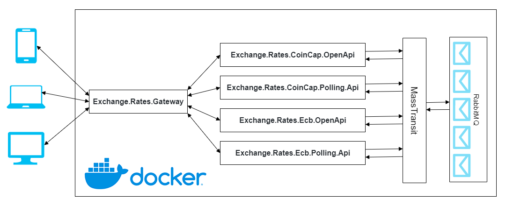
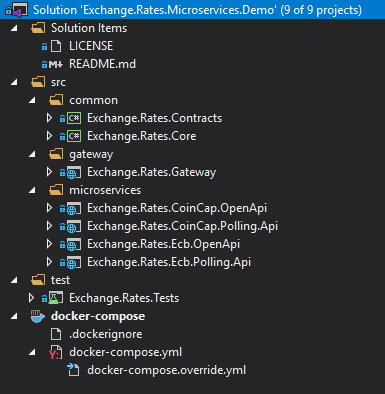
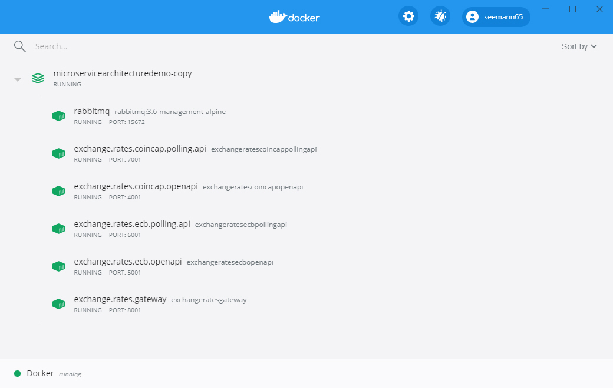
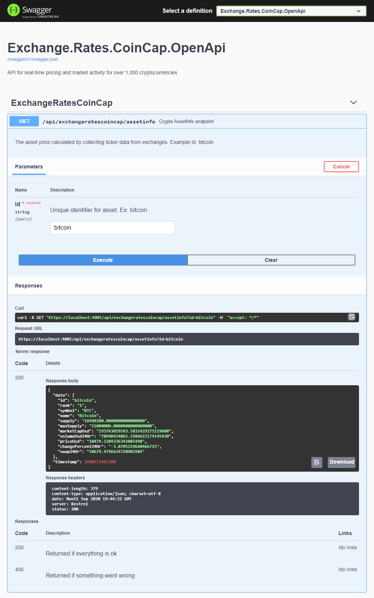
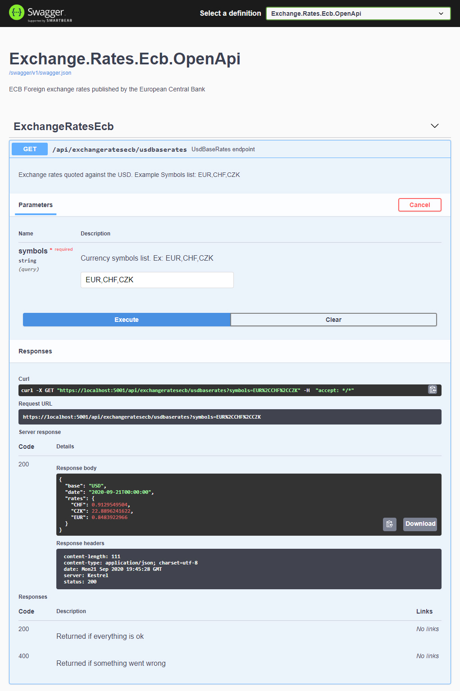
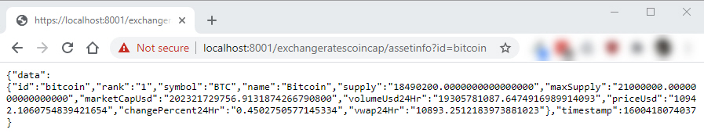
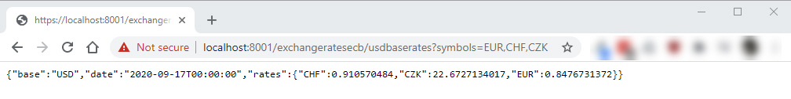
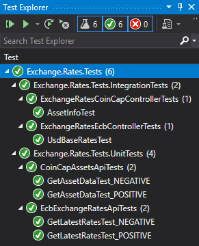

# Microservice Architecture in ASP.NET Core

This demo shows a working sample of microservices architecture using ASP.NET Core 6. It covers how to create microservices, how to create API gateways using [Ocelot](https://github.com/ThreeMammals/Ocelot), how to use [MassTransit](http://masstransit-project.com) as distributed application framework, [RabbitMQ](https://www.rabbitmq.com) as the message broker, how to unit test microservices using [xUnit](https://xunit.net) and how to deploy microservices using [Docker](https://www.docker.com/resources/what-container) containers on Linux distributions.

## Introduction

A microservices architecture consists of a collection of small, independent, and loosely coupled services. Each service is self-contained, implements a single business capability, is responsible for persisting its own data, is a separate codebase, and can be deployed independently. Microservices do not know about each other and the only coupling between them is the standalone contract project that both references.

API gateways are entry points for clients. Instead of calling services directly, clients call the API gateway, which forwards the call to the appropriate services.

## Advantages

* Services are easy and self-deployable
* Services are easy to change and test
* Services can be deployed in multiple servers to enhance performance
* Failure in one service does not impact other services
* It's easier to manage bug fixes and feature releases
* Developers can better understand the functionality of a service

## Why MassTransit?
[MassTransit](http://masstransit-project.com) is a free, open source, lightweight distributed application framework for creating distributed applications using the .NET framework. MassTransit provides an extensive set of features on top existing message transports, resulting in a developer friendly way to asynchronously connect services using message-based conversation patterns. Message-based communication is a reliable and scalable way to implement a service oriented architecture.
If you want to know more please visit [MassTransit](http://masstransit-project.com).

## Why RabbitMQ?
[RabbitMQ](https://www.rabbitmq.com) describes itself as the most widely deployed open-source message broker. It is easy to implement and supports a wide variety of technologies like Docker, .Net or Go. It also offers plugins for monitoring, managing or authentication. I've chose RabbitMQ because it is well known, quickly implemented and especially can be easily run using Docker.

## Why Ocelot?
There are so many API Gateway frameworks from Open Source to Commercial, but you have to buy license or subscription like NGNIX, Kong, Tyk ...
Microsoft and Amazon also provide API Gateway services on the cloud: [Azure API Management](https://azure.microsoft.com/en-us/services/api-management/) and [AWS API Gateway](https://aws.amazon.com/api-gateway/).
[Ocelot](https://github.com/ThreeMammals/Ocelot) is an open-source API Gateway built on ASP.Net Core. Although, it is lightweight but it also provides fully basic functions that an API Gateway must-have (Routing, API Composition, Caching, Logging, Integration with Identity Provider, Rate limiting).

## Architecture
* **Exchange.Rates.Gateway**: Gateway to all APIs
* **Exchange.Rates.CoinCap.OpenApi**: REST for retrieving pricing and market activity for crypto currencies
* **Exchange.Rates.CoinCap.Polling.Api**: Service to retrieve crypto currencies info. It uses [CoinCap API 2.0](https://docs.coincap.io/)
* **Exchange.Rates.Ecb.OpenApi**: REST for European Central Bank (ECB) Foreign exchange rates
* **Exchange.Rates.Ecb.Polling.Api**: Service to retrieve ECB exchange rates. It uses [ECB Foreign exchange rates API](https://exchangeratesapi.io/). Since you will need an API Key you have to [Sign Up](https://exchangeratesapi.io/pricing/).

Each service is hosted in it's own Docker container (take a look into docker-compose project).



## Implementation
For a sake of simplicity I didn't implement any load balancing, service discovery or identity functionality. I've used a [Docker Desktop](https://www.docker.com/products/docker-desktop) for Windows, so I didn't pollute my development environment with many things concurrently installed. I also assumed you know how to work [using Docker](https://docs.docker.com/docker-for-windows/) workflow.

Solution folder structure looks like this:  


## Certificate
Creating a Certificate to use ASP.NET Core with **HTTPS** in Docker you can create a certificate with command: **dotnet dev-certs https -ep [Path]-p [Password]**. I've created the certificate with SecretPassword as its password.
After creating the certificate, you only have to share it with your container.  
**NOTE:** You must set a password. Otherwise, Kestrel won’t be able to use the certificate!

## Docker-Compose Files
**Docker-compose.yml** file with setup for all the containers looks like this:
```yml
version: '3.9'

services:
    rabbitmq:
        container_name: rabbitmq
        image: rabbitmq:3.8-management-alpine
        hostname: rabbitmq
        networks:
            - common_network

    exchange.rates.coincap.openapi:
        container_name: exchange.rates.coincap.openapi
        image: exchange.rates.coincap.openapi:latest
        build:
            context: .
            dockerfile: Exchange.Rates.CoinCap.OpenApi/Dockerfile
        restart: on-failure
        depends_on:
            - rabbitmq
        networks:
            - common_network

    exchange.rates.coincap.polling.api:
        container_name: exchange.rates.coincap.polling.api
        image: exchange.rates.coincap.polling.api:latest
        build:
            context: .
            dockerfile: Exchange.Rates.CoinCap.Polling.Api/Dockerfile
        depends_on:
            - rabbitmq
        networks:
            - common_network

    exchange.rates.ecb.openapi:
        container_name: exchange.rates.ecb.openapi
        image: exchange.rates.ecb.openapi:latest
        build:
            context: .
            dockerfile: Exchange.Rates.Ecb.OpenApi/Dockerfile
        depends_on:
            - rabbitmq
        networks:
            - common_network

    exchange.rates.ecb.polling.api:
        container_name: exchange.rates.ecb.polling.api
        image: exchange.rates.ecb.polling.api:latest
        build:
            context: .
            dockerfile: Exchange.Rates.Ecb.Polling.Api/Dockerfile
        depends_on:
            - rabbitmq
        networks:
            - common_network

    exchange.rates.gateway:
        container_name: exchange.rates.gateway
        image: exchange.rates.gateway:latest
        build:
            context: .
            dockerfile: Exchange.Rates.Gateway/Dockerfile
        restart: on-failure
        networks:
            - common_network
        depends_on:
            - exchange.rates.ecb.openapi
            - exchange.rates.coincap.openapi

networks:
  common_network: {}
```
and **Docker-compose.override.yml** file:
```yml
version: '3.9'

services:
    rabbitmq:
        environment:
            - RABBITMQ_DEFAULT_USER=guest
            - RABBITMQ_DEFAULT_PASS=guest
        ports:
            - 5672:5672
            - 15672:15672

    exchange.rates.coincap.openapi:
        environment:
            - ASPNETCORE_ENVIRONMENT=Development
            - ASPNETCORE_URLS=https://+:443;http://+:80
            - Kestrel__Certificates__Default__Path=/app/Infrastructure/Certificate/cert-aspnetcore.pfx
            - Kestrel__Certificates__Default__Password=SecretPassword
        ports:
            - 4000:80
            - 4001:443
        volumes:
            - ${APPDATA}/Microsoft/UserSecrets:/root/.microsoft/usersecrets:ro
            - ${APPDATA}/ASP.NET/Https:/root/.aspnet/https:ro

    exchange.rates.coincap.polling.api:
        environment:
            - ASPNETCORE_ENVIRONMENT=Development
            - ASPNETCORE_URLS=https://+:443;http://+:80
            - Kestrel__Certificates__Default__Path=/app/Infrastructure/Certificate/cert-aspnetcore.pfx
            - Kestrel__Certificates__Default__Password=SecretPassword
        ports:
            - 7000:80
            - 7001:443
        volumes:
            - ${APPDATA}/Microsoft/UserSecrets:/root/.microsoft/usersecrets:ro
            - ${APPDATA}/ASP.NET/Https:/root/.aspnet/https:ro

    exchange.rates.ecb.openapi:
        environment:
            - ASPNETCORE_ENVIRONMENT=Development
            - ASPNETCORE_URLS=https://+:443;http://+:80
            - Kestrel__Certificates__Default__Path=/app/Infrastructure/Certificate/cert-aspnetcore.pfx
            - Kestrel__Certificates__Default__Password=SecretPassword
        ports:
            - 5000:80
            - 5001:443
        volumes:
            - ${APPDATA}/Microsoft/UserSecrets:/root/.microsoft/usersecrets:ro
            - ${APPDATA}/ASP.NET/Https:/root/.aspnet/https:ro

    exchange.rates.ecb.polling.api:
        environment:
            - ASPNETCORE_ENVIRONMENT=Development
            - ASPNETCORE_URLS=https://+:443;http://+:80
            - Kestrel__Certificates__Default__Path=/app/Infrastructure/Certificate/cert-aspnetcore.pfx
            - Kestrel__Certificates__Default__Password=SecretPassword
        ports:
            - 6000:80
            - 6001:443
        volumes:
            - ${APPDATA}/Microsoft/UserSecrets:/root/.microsoft/usersecrets:ro
            - ${APPDATA}/ASP.NET/Https:/root/.aspnet/https:ro

    exchange.rates.gateway:
        environment:
            - ASPNETCORE_ENVIRONMENT=Development
            - ASPNETCORE_URLS=https://+:443;http://+:80
            - Kestrel__Certificates__Default__Path=/app/Infrastructure/Certificate/cert-aspnetcore.pfx
            - Kestrel__Certificates__Default__Password=SecretPassword
        ports:
            - 8000:80
            - 8001:443
        volumes:
          - ${APPDATA}/Microsoft/UserSecrets:/root/.microsoft/usersecrets:ro
          - ${APPDATA}/ASP.NET/Https:/root/.aspnet/https:ro
```
**NOTE**: When starting multiple containers with a compose file, a **common_network** is created in **which all containers are using**. Containers can reach each other with the container name.

## Setup the Containers
To execute compose file, open Powershell, and navigate to the compose file in the root folder. Then execute the following command: **docker-compose up -d --build --remove-orphans**. The -d parameter executes the command detached. This means that the containers run in the background and don’t block your Powershell window.
To check all running Containers use **docker ps**.

## Runnig in Docker


## Swagger UI for [Exchange.Rates.CoinCap.OpenApi](https://localhost:4001/swagger/index.html)


## Swagger UI for [Exchange.Rates.Ecb.OpenApi](https://localhost:5001/swagger/index.html)


## Call Gateway
Let’s try to access **CoinCap API** through API Gateway:
**https://localhost:8001/exchangeratescoincap/assetinfo?id=ethereum**

And access **Ecb API** through API Gateway:
**https://localhost:8001/exchangeratesecb/eurbaserates?symbols=USD,CHF,CZK**


## Testing
Test project includes both Unit and Integration tests:


## Conclusion
From today’s DevOps position it is necessary to change applications fast and often. Additionally, microservices should run inside a container and Docker is the defacto standard container.

Enjoy!

## Prerequisites
- [Visual Studio](https://www.visualstudio.com/vs/community) 2022 17.2.6 or greater
- [.NET SDK 6.0](https://dotnet.microsoft.com/download/dotnet/6.0)
- [Docker](https://www.docker.com/resources/what-container)

## Tags & Technologies
- [.NET 6](https://github.com/dotnet/core/blob/main/release-notes/6.0)
- [ASP.NET Core 6.0](https://docs.microsoft.com/en-us/aspnet/core/release-notes/aspnetcore-6.0?view=aspnetcore-6.0)
- [Ocelot](https://github.com/ThreeMammals/Ocelot)  
- [MassTransit](http://masstransit-project.com)  
- [RabbitMQ](https://www.rabbitmq.com)  
- [OpenAPI](https://swagger.io/specification/)
- [Serilog](https://serilog.net/)
- [xUnit](https://xunit.net)

## Licence
Licenced under [MIT](http://opensource.org/licenses/mit-license.php).
Contact me on [LinkedIn](https://si.linkedin.com/in/matjazbravc).
